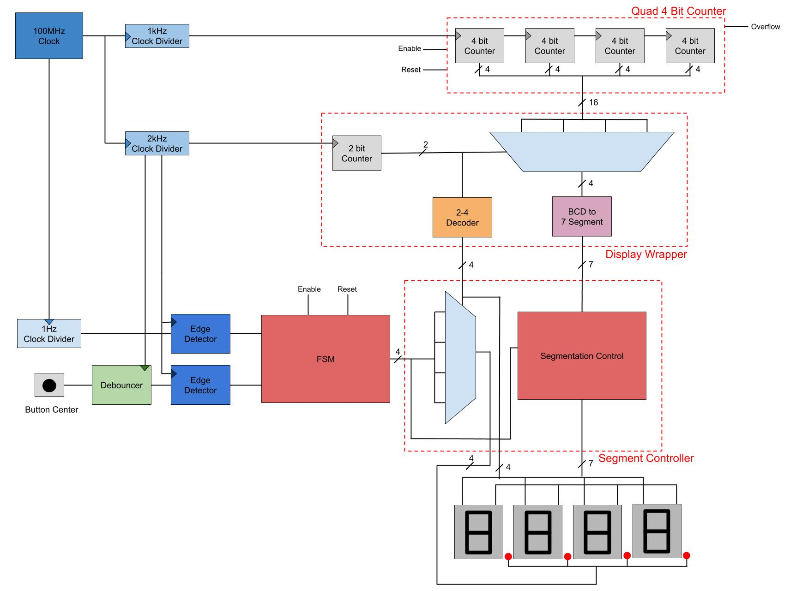
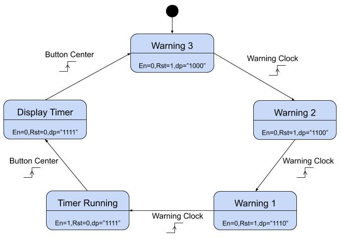

# Reaction Timer 
The reaction timer project is designed to test the user's reaction time. On startup, it prompt the user with three decimal points on the seven segment display which begin to countdown and inform the user that the process has begun. After the final decimal point has turned off, the ‘reaction timing’ sequence begins and a timer begins to run which is also displayed on the seven segment display until the centre button is pushed (BTNC). Lastly the elapsed time of when BTNC was pressed remains displayed until the user presses BTNC again, this restarts the entire process from countdown.

## Getting Started
The project can be synthesized and programed using the [Vivado IDE](https://www.xilinx.com/support/download.html). The timer is tested on the Nexys-4 DDR FPGA but should work on any other board by changing the constraint file.

### Top Level Block Diagram

### FSM State Transition Diagram
The state transition diagram is shown as below. The warning clock and the button is fed to the FSM through an edge detector. The edge detector outputs a high pulse for a single clock cycle for an rising edge.

### Authors
* Randipa Gunathilake (wrg20@uclive.ac.nz) 
* Geeth Rathnayake (wgr29@uclive.ac.nz)
* Jeremy Long (jhl83@uclive.ac.nz)